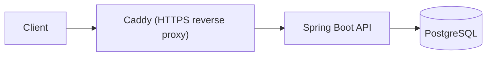
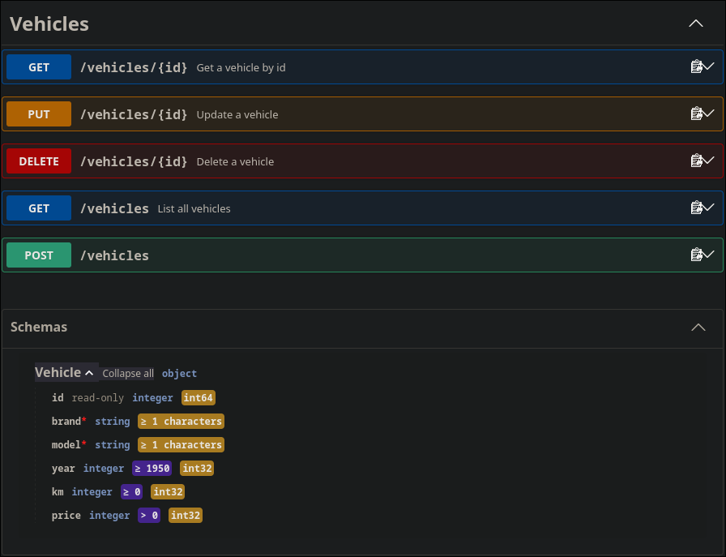

# Vehicle Inventory API


A REST API for managing a car dealer's vehicle inventory, built with Spring Boot and PostgreSQL and run with Docker Compose. It's a learning project that models the kind of data I handle at work (vehicle listings), using sample data only.

## Tech stack

- Java 21, Spring Boot 4.1.1 (Spring Web, Spring Data JPA, Bean Validation)
- PostgreSQL 17 with Flyway migrations
- Maven
- Docker and Docker Compose, Caddy as reverse proxy
- springdoc-openapi (Swagger UI) for API documentation
- JUnit 5, Mockito and MockMvc for tests

## Run it

Requirements: Docker with the Compose plugin.

```bash
git clone https://github.com/rszabadi/swiss.git
cd swiss
cp .env.example .env
# edit .env and set your own DB_PASSWORD
docker compose up -d --build
```

Interactive documentation (Swagger UI) is available at `https://localhost:8443/swagger-ui/index.html` with Docker, or at `http://localhost:8080/swagger-ui/index.html` when the app runs from an IDE.

```bash
curl -k https://localhost:8443/vehicles
```

Stop it with `docker compose down`. The database data is kept in a Docker volume.

## Development

Run only the database in Docker and start the app from your IDE:

```bash
docker compose up -d db
```

The app then listens on `http://localhost:8080`.

## API

| Method | Path | Description |
|---|---|---|
| GET | `/vehicles` | List all vehicles |
| GET | `/vehicles/{id}` | Get one vehicle (404 if missing) |
| POST | `/vehicles` | Create a vehicle (400 if invalid) |
| PUT | `/vehicles/{id}` | Update a vehicle |
| DELETE | `/vehicles/{id}` | Delete a vehicle |

Example request:

```bash
curl -k -X POST https://localhost:8443/vehicles \
  -H "Content-Type: application/json" \
  -d '{"brand":"Toyota","model":"Celica","year":1994,"km":41000,"price":11500}'
```

### Documents

Each vehicle has a checklist of documents (technical sheet, registration permit, ITV certificate, sales contract).

| Method | Path | Description |
|---|---|---|
| GET | `/vehicles/{id}/documents` | List a vehicle's documents |
| POST | `/vehicles/{id}/documents` | Add a document (409 if the type already exists) |
| PUT | `/vehicles/{id}/documents/{docId}` | Update status and expiry date |
| DELETE | `/vehicles/{id}/documents/{docId}` | Delete a document |

Example request:

```bash
curl -k -X POST https://localhost:8443/vehicles/1/documents \
  -H "Content-Type: application/json" \
  -d '{"type":"ITV_CERTIFICATE","expiresOn":"2027-03-15"}'
```

Document status is `PENDING` or `RECEIVED`.

## Tests

```bash
docker compose up -d db
./mvnw test
```

The tests need the database running locally. CI runs them automatically on every push.

## Backups

```bash
./scripts/backup.sh
```

Writes a compressed SQL dump to `backups/` and deletes dumps older than 14 days. To restore, pipe a dump into `psql` on an **empty** database:

```bash
gunzip -c backups/<file>.sql.gz | docker compose exec -T db sh -c 'psql -U "$POSTGRES_USER" -d "$POSTGRES_DB"'
```

## Architecture



Only Caddy is exposed to the host. The API and the database are reachable only inside the Docker network (and the database on localhost for development).

## API documentation

Interactive documentation (Swagger UI) is available at `/swagger-ui/index.html` when the app runs locally.



## Roadmap

- [x] CRUD endpoints with input validation
- [x] Vehicle document checklist
- [x] Docker Compose setup
- [x] Integration tests
- [x] CI with GitHub Actions
- [x] Database migrations (Flyway)
- [x] Logging and database backups
- [x] API documentation (Swagger UI)
- [ ] Vehicle status and DTOs
- [ ] Consistent JSON error responses
- [ ] Tests with their own database (Testcontainers)
- [ ] Deployment on a Linux server with a reverse proxy and HTTPS
